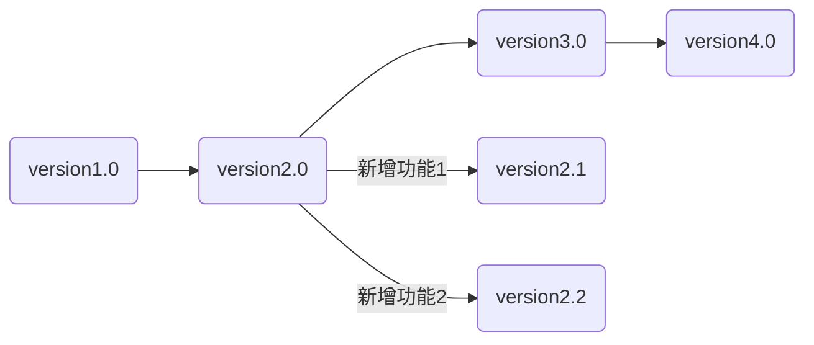
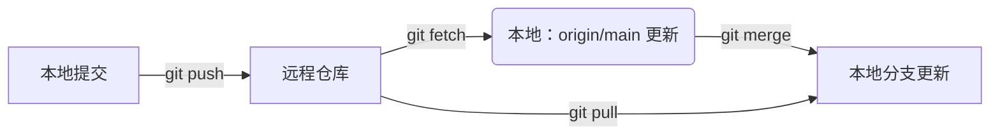
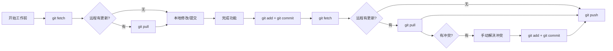

##  一、基础部分

### 1. 一些概念
- **Remote（远程版本库）**：存储在云端的库，例如你和他人在github、gitee上的库
- **Origin**：直接关联的仓库
- **Upstream**：上游库，即你fork的别人的库
- **Work space（工作区）**：正在编辑的文件所在的文件夹
- **Repository（版本库）**：工作区有一个隐藏目录`.git`，是Git的版本库/也可指github等的远程版本库
- **Staging Area（暂存区）**：提交至本地仓库前的暂存区

### 2. branch

git是用于版本控制的工具，他将每次提交的代码版本像树杈一样保存，于是就有了branch（分支），主干部分也是一个branch，称为main/master，每个branch都是一个独立开发线。
分支的核心意义在于提供“隔离的、安全的、并行的开发环境”。它允许多个工作流（开发新功能、修复 Bug、尝试实验、发布版本）在不互相干扰的情况下同时进行，是现代软件开发（尤其是协作）的生命线。
分支本质上就是指向某个提交 (Commit) 的轻量级指针，创建分支成本极低（几乎不占空间）。当功能完成、Bug 修复好或实验成功后，通过 `git merge` (合并) 或 `git rebase` (变基) 将分支上的改动整合回目标分支（如 main）。
使用branch的好处有：

-  保护主分支（通常是 `main`）的稳定性。未经验证的代码不会污染主分支
-  极大提升团队开发效率，不同任务可以同时推进
-  尝试新想法或重构时没有后顾之忧

与分支有关的命令：
- `git branch` ：查看分支列表（标注`*`的为当前所在分支）
- `git branch <new-branch-name>`：创建新分支
- `git checkout <branch-name>`或`git switch <branch-name>`：切换到分支
- `git checkout -b <new-branch-name>`：创建并切换到新分支

### 3. 自己维护的项目

#### 1. 创建库

如果你想开始一个自己的项目，可以在github中创建一个repository，然后进入本地完成好的项目文件目录下
1. 使用 `git remote add origin <url>` （url为github库的网址，例如：``https://github.com/NEW_USERNAME/my-new-repo.git``）将你创建的github库和本地仓库联系起来，此操作只需做一次
2. 使用 `git add <file_name> / git add .` 将工作区的修改添加到暂存区（准备提交）
3. 使用 `git commit -m "your describtion"` 提交到本地的 Git 仓库（位于项目隐藏的 `.git`目录中）
4. 使用 `git push origin <branch_name>` 将本地仓库的新提交上传到远程仓库（如 GitHub 的 `main` 分支）
   - `-u` 告诉 Git，将本地的 `main` 分支与远程 `origin` 上的 `main` 分支关联起来。设置好后，后续在这个分支上直接运行 `git push` 或 `git pull`，Git 就知道应该推送到/拉取自哪个远程仓库的哪个分支，无需再指定 `origin main`

***add、commit、push辨析***

***为何需要使用add进入暂存区，再commit至本地仓库？***   
如果你一次性修改了多个模块的文件，`git add <file>`允许你将特定文件的改动放入暂存区，
`git commit -m "your describtion"`只提交暂存区里的内容，这样就保证了每个提交只做一件逻辑清晰的事情（比如只修复一个 bug 或只添加一个功能），每次提交的改动都是有迹可寻的（构建原子提交 (Atomic Commits)）     
你可以在本地多次 `commit`，最后一次性 `push` 所有提交，本地 `commit` 允许你反复修改、撤销（用 `git reset`），确认无误后再分享到远程    
团队成员独立开发 → 本地频繁 `commit` → 功能完成后再 `push` 合并，互不干扰

另外可以使用 `git status` 显示哪些文件在工作区修改了（红色），哪些修改在暂存区准备好了（绿色）   
  

### 4. 和他人协作  

#### 1. Clone
首先在 GitHub 上点击原仓库的 Fork 按钮，创建属于你账号的副本仓库，从而获得独立开发空间，避免直接污染原仓库  
- `git clone https://github.com/你的用户名/仓库名.git`，克隆你fork的仓库到本地
- `git remote add upstream https://github.com/原作者/原仓库.git`，通过 `upstream` 指向原仓库，后续可拉取最新代码

fork的仓库是独立于原仓库的，任何改动都不会影响原仓库。后续对fork仓库的管理按照上一节教程即可。  
如果你想让原仓库应用你的更改，可以进入你的 GitHub 仓库页面，点击 `Compare & pull request`，维护者会决定是否采纳你的更改

#### 2. Fetch+Merge=Pull & Push

- `git fetch origin`：只获取更新，不修改本地  
- `git merge origin/main`：合并分支改动，将指定分支的提交合并到当前分支，可能产生冲突需手动解决
- `git pull`：一键拉取并合并更新，若远程更新与本地修改冲突，会自动触发合并冲突（需手动解决）
  
  `git pull origin main` = `git fetch origin` + `git merge origin main`

`git push`：将本地分支的提交上传到远程仓库的对应分支,**本地分支必须基于远程分支的最新提交（否则需先 pull 解决冲突）**   

***为什么 Push 前一定要 Pull？***   
这条规则是为了解决 “你的本地历史落后于远程仓库” 导致的问题，比如你最初是在A版本下进行的更改，得到了版本B，但此时远程仓库中已经是版本C了，
你就需要先处理B和C之间的冲突，即远程修改和你的本地修改冲突时（修改了同一文件的同一行）     
这样保证你的推送是基于远程最新版本，整合了所有更新，避免覆盖他人工作或推送失败。此时你的本地 main 分支包含了 A -> B -> C -> M（或 A -> C -> B -> M），与远程历史一致，推送成功。
以下有几种情况：
1. 未进行更改，pull会直接合并，你的本地分支更新到最新状态
2. 在work space中修改了，但没有add进暂存区，或add进了暂存区但未commit进本地仓库（即更改仍停留在工作区和暂存区，未进入本地仓库），此时进行pull，git会拒绝合并
3. 已commit进本地仓库，但未push，Git 会尝试自动合并（Auto-merge）。如果远程修改和你的本地修改不冲突（修改了不同文件/同一文件不同区域），则合并成功，你的提交和别人的远程提交会共存

因此：
- 工作/推送前，先pull更新本地库
- 解决可能的冲突
- push

