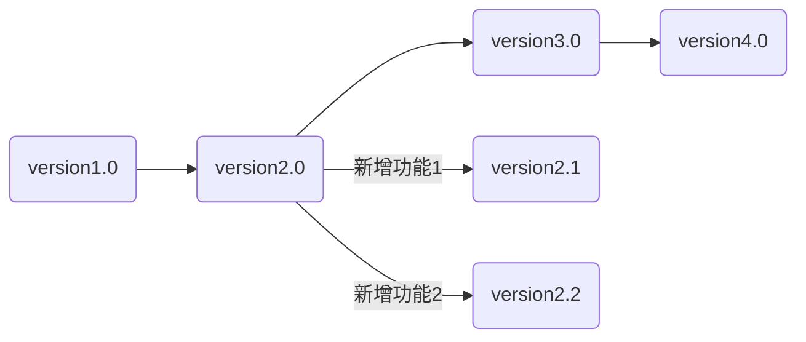

##  一、基础部分

### 1. 一些概念
- **Repository（仓库）**：顾名思义，存储代码的地方
- **Remote（远程仓库）**：存储在云端的库，例如你和他人在github、gitee上的库
- **Origin**：直接关联的仓库
- **Upstream**：上游库，即你fork的别人的库
- **Work space（工作区）**：正在编辑的文件
- **Staging Area（暂存区）**：提交至本地仓库前的暂存区
### 2. branch

git是用于版本控制的工具，他将每次提交的代码版本像树杈一样保存，于是就有了branch（分支），主干部分也是一个branch，称为main/master，每个branch都是一个独立开发线。
分支的核心意义在于提供“隔离的、安全的、并行的开发环境”。它允许多个工作流（开发新功能、修复 Bug、尝试实验、发布版本）在不互相干扰的情况下同时进行，是现代软件开发（尤其是协作）的生命线。
分支本质上就是指向某个提交 (Commit) 的轻量级指针，创建分支成本极低（几乎不占空间）。当功能完成、Bug 修复好或实验成功后，通过 `git merge` (合并) 或 `git rebase` (变基) 将分支上的改动整合回目标分支（如 main）。
使用branch的好处有：

-  保护主分支（通常是 `main`）的稳定性。未经验证的代码不会污染主分支
-  极大提升团队开发效率，不同任务可以同时推进
-  尝试新想法或重构时没有后顾之忧

与分支有关的命令：
- `git branch` ：查看分支列表（标注`*`的为当前所在分支）
- `git branch <new-branch-name>`：创建新分支
- `git checkout <branch-name>`或`git switch <branch-name>`：切换到分支
- `git checkout -b <new-branch-name>`：创建并切换到新分支

### 3. 自己维护的项目

#### 1. 创建库

如果你想开始一个自己的项目，可以在github中创建一个repository，然后进入本地完成好的项目文件目录下
1. 使用 `git remote add origin <url>` （url为github库的网址，例如：``https://github.com/NEW_USERNAME/my-new-repo.git``）将你创建的github库和本地仓库联系起来，此操作只需做一次
2. 使用 `git add <file_name> / git add .` 将工作区的修改添加到暂存区（准备提交）
3. 使用 `git commit -m "your describtion"` 提交到本地的 Git 仓库（位于项目隐藏的 `.git`目录中）
4. 使用 `git push origin <branch_name>` 将本地仓库的新提交上传到远程仓库（如 GitHub 的 `main` 分支）
   - `-u` 告诉 Git，将本地的 `main` 分支与远程 `origin` 上的 `main` 分支关联起来。设置好后，后续在这个分支上直接运行 `git push` 或 `git pull`，Git 就知道应该推送到/拉取自哪个远程仓库的哪个分支，无需再指定 `origin main`

***add、commit、push辨析***

***为何需要使用add进入暂存区，再commit至本地仓库？***   
如果你一次性修改了多个模块的文件，`git add <file>`允许你将特定文件的改动放入暂存区，
`git commit -m "your describtion"`只提交暂存区里的内容，这样就保证了每个提交只做一件逻辑清晰的事情（比如只修复一个 bug 或只添加一个功能），每次提交的改动都是有迹可寻的（构建原子提交 (Atomic Commits)）  
另外可以使用 `git status` 显示哪些文件在工作区修改了（红色），哪些修改在暂存区准备好了（绿色）

### 4. 和他人协作  
