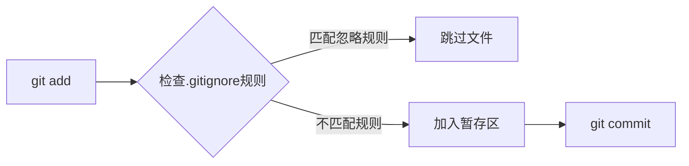
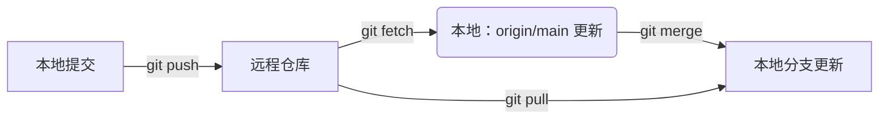
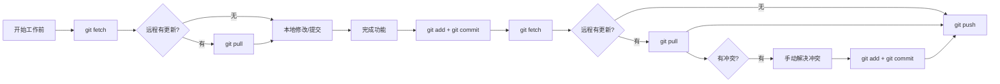
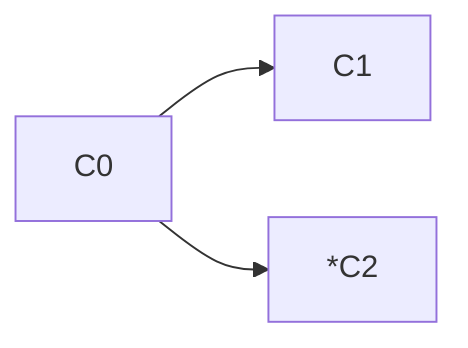
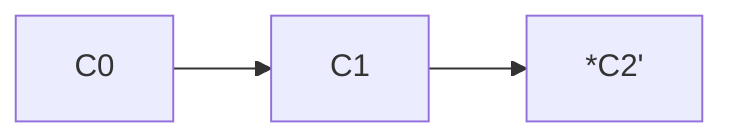
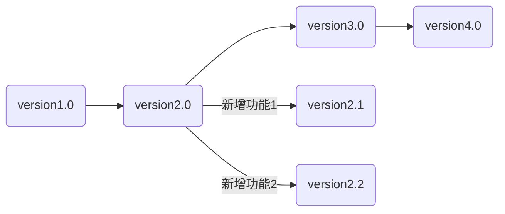
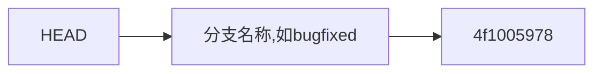

## 一、Git之本地仓库

笔者曾经傻傻的认为git和github是紧密不可分的两个东西，git是服务于github的一个工具，然而实际上恰恰相反，github才是服务于git的一种东西，git和github也并非不可分割。

Git最初的用途是用于管理本地代码，记录代码的版本更迭，这样就可以随时回到之前可用的代码，防止代码越改越乱、越改越烂(x_x) （当然不止这个用途），后来出现了github和gitee等用于远程存储代码的网站，大家就可以将代码备份在云端，更加安全。   

#### 1. 空目录开始
在一个空文件夹下`git init`，把这个目录变成Git可以管理的仓库，`ls -a`显示隐藏文件后会发现出现了一个`.git`文件，这个文件中会储存版本、分支、log等git管理的内容（概念后续辨析）。   

在该文件夹中创建文件，添加代码，这个文件夹就叫**work space（工作区）**，工作区的隐藏目录`.git`就是一个**Repository（版本库）**   

写完代码后   

1. 使用 `git add <file_name> / git add .` 将工作区的修改添加到暂存区（准备提交）
2. 使用 `git commit -m "your describtion"` 提交到本地的 Git 仓库（位于项目隐藏的 `.git`目录中）   

***为何需要使用add进入暂存区，再commit至本地仓库？（暂存区的作用）***    
如果你一次性修改了多个模块的文件，`git add <file>`允许你将特定文件的改动放入暂存区，`git commit -m "your describtion"`只提交暂存区里的内容，这样就保证了每个提交只做一件逻辑清晰的事情（比如只修复一个 bug 或只添加一个功能），每次提交的改动都是有迹可寻的

本地 `commit` 允许你反复修改、撤销（用 `git reset`）

另外可以使用 `git status` 显示哪些文件在工作区修改了（红色），哪些修改在暂存区准备好了（绿色）   

***add、commit辨析***

     


***`.gitignore`文件***   

在工作区中还需要一个`.gitignore`文件，用于存放一些不希望使用git管理的文件的文件名，可以减少仓库体积、保障安全……      

`.gitignore`文件本身要放到版本库里，并且可以对`.gitignore`做版本管理   


文件内容例如：   

```
CMakeLists.txt.user
CMakeCache.txt
CMakeFiles
CMakeScripts
Testing
Makefile
cmake_install.cmake
install_manifest.txt
compile_commands.json
CTestTestfile.cmake
_deps
CMakeUserPresets.json
build
.cache
.DS_Store
.VSCodeCounter
app
assembly.txt
.vscode
assembly.txt
……
```

以下这些文件一般不必使用git跟踪：   
1. **操作系统垃圾文件**
2. **IDE/编辑器配置**
3. **依赖与编译产物**
4. **日志与临时文件**
5. **敏感信息（环境变量、密钥文件**）

这些内容只需大致了解，不必掌握，要用时问AI即可   



#### 2. 非空目录开始   
 
 在一个非空目录下`git init`，也会出现一个`.git`文件，但是使用`git status`查询工作区和本地库状态时，会发现所有现有文件会立即被识别为 未跟踪(untracked) 状态，即未被本地git库连接。   
 此时不应急于add+commit将现有文件提交入库，而应该创建一个`.gitignore`文件紧急加入需要忽略的文件   
 
```
git init
echo "node_modules/" >> .gitignore # 紧急补救
git add .gitignore                # 先提交忽略规则
```
 
如果已经commit了所有文件，需要   
```
# 1. 初始化后立即创建.gitignore，例如：
echo ".env" >> .gitignore
echo "*.key" >> .gitignore

# 2. 移除已暂存的敏感文件
git rm --cached config.key

# 3. 提交安全版本
git add .gitignore
git commit -m "安全初始化"
```   

## 二、Git之远程仓库   

Git不仅可以用于本地版本库管理，还可以配合github和gitee等远程仓库管理代码。   

### 1. 自己维护的项目

#### 创建库

如果你想开始一个自己的项目，可以在github中创建一个repository，然后进入本地完成好的项目文件目录下
1. 使用 `git remote add origin <url>` （url为github库的网址，例如：``https://github.com/USERNAME/my-new-repo.git``，`origin`是默认的远程仓库名称）将你创建的github库和本地仓库联系起来，此操作只需做一次
2. 使用 `git add <file_name> / git add .` 将工作区的修改添加到暂存区（准备提交）
3. 使用 `git commit -m "your describtion"` 提交到本地的 Git 仓库（位于项目隐藏的 `.git`目录中）
4. 使用 `git push origin <branch_name>` 将本地仓库的新提交上传到远程仓库的某个分支（如 GitHub 的 `main` 分支）
   - `-u` 告诉 Git，将本地的 `main` 分支与远程 `origin` 上的 `main` 分支关联起来。设置好后，后续在这个分支上直接运行 `git push` 或 `git pull`，Git 就知道应该推送到/拉取自哪个远程仓库的哪个分支，无需再指定 `origin main`   

你可以在本地多次 `commit`，最后一次性 `push` 所有提交   

### 2. 和他人协作  

#### 1. Clone
首先在 GitHub 上点击原仓库的 Fork 按钮，创建属于你账号的副本仓库，从而获得独立开发空间，避免直接污染原仓库  
- `git clone https://github.com/你的用户名/仓库名.git`，克隆你fork的仓库到本地
- `git remote add upstream https://github.com/原作者/原仓库.git`，通过 `upstream` 指向原仓库，后续可拉取最新代码

fork的仓库是独立于原仓库的，任何改动都不会影响原仓库。后续对fork仓库的管理按照上一节教程即可。  
如果你想让原仓库应用你的更改，可以进入你的 GitHub 仓库页面，点击 `Compare & pull request`，维护者会决定是否采纳你的更改

#### 2. Fetch+Merge=Pull & Push

- `git fetch origin`：只获取更新，不修改本地  
- `git merge origin/main`：合并分支改动，将指定分支的提交合并到当前分支，可能产生冲突需手动解决
- `git pull`：一键拉取并合并更新，若远程更新与本地修改冲突，会自动触发合并冲突（需手动解决）
  
`git pull origin main` = `git fetch origin` + `git merge origin main`


`git push`：将本地分支的提交上传到远程仓库的对应分支,**本地分支必须基于远程分支的最新提交（否则需先 pull 解决冲突）**   

***为什么 Push 前一定要 Pull？***   
这条规则是为了解决 “你的本地历史落后于远程仓库” 导致的问题，比如你最初是在A版本下进行的更改，得到了版本B，但此时远程仓库中已经是版本C了，
你就需要先处理B和C之间的冲突，即远程修改和你的本地修改冲突时（修改了同一文件的同一行）     
这样保证你的推送是基于远程最新版本，整合了所有更新，避免覆盖他人工作或推送失败。此时你的本地 main 分支包含了 A -> B -> C -> M（或 A -> C -> B -> M），与远程历史一致，推送成功。
以下有几种情况：
1. 未进行更改，pull会直接合并，你的本地分支更新到最新状态
2. 在work space中修改了，但没有add进暂存区，或add进了暂存区但未commit进本地仓库（即更改仍停留在工作区和暂存区，未进入本地仓库），此时进行pull，git会拒绝合并
3. 已commit进本地仓库，但未push，Git 会尝试自动合并（Auto-merge）。如果远程修改和你的本地修改不冲突（修改了不同文件/同一文件不同区域），则合并成功，你的提交和别人的远程提交会共存

因此：
- 工作/推送前，先pull更新本地库
- 解决可能的冲突
- push




#### 3. rebase  (变基)  
第二种合并分支的方法是 `git rebase`。Rebase 实际上就是取出一系列的提交记录，“复制”它们，然后在另外一个地方逐个的放下去。Rebase 的优势就是可以创造更线性的提交历史，看上去会很清晰。    
示例如下：  



在C2分支上 `git rebase C1`，表示将C2的“base”换成C1，则提交记录变为：    



## 三、后悔药   

### 1. 版本回退

- `git log`：查看git日志，获取`[commit id]`
- `git reflog`：查看命令历史
- `git reset --xxx <commit_id>`：适用于本地的版本回退
- `git revert [commit_id]`：适用于远程分支的版本回退

#### 1. `git reset`
- `git reset --soft [commit_id]`：只移动 HEAD 指针和分支指针。你的工作目录和暂存区中的文件保持不变。这通常用于你只是想撤销一个提交，但想保留所有修改，以便重新提交
- `git reset --mixed [commit_id]`（默认）：移动 HEAD 指针和分支指针，并且重置暂存区。你的工作目录中的文件保持不变。这个操作相当于 `git reset --soft` 之后再执行 `git restore --staged .`
- `git reset --hard [commit_id]`：这是最彻底的回退方式。它会移动 HEAD 指针和分支指针，并且重置暂存区和工作目录。这意味着所有在 `[commit_id]` 之后提交的修改都会被彻底删除，无法恢复。使用时务必谨慎

#### 2. `git revert`
一种“安全”的回退方式。它不会删除历史提交，而是创建一个新的提交来撤销指定提交中的更改，因此不会影响其他协作者的提交历史，可以安全地推送到远程仓库


## 四、 分支管理   

### branch

git是用于版本控制的工具，他将每次提交的代码版本像树杈一样保存，于是就有了branch（分支），主干部分也是一个branch，称为main/master，每个branch都是一个独立开发线。
分支的核心意义在于提供“隔离的、安全的、并行的开发环境”。它允许多个工作流（开发新功能、修复 Bug、尝试实验、发布版本）在不互相干扰的情况下同时进行，是现代软件开发（尤其是协作）的生命线。
分支本质上就是指向某个提交 (Commit) 的轻量级指针，创建分支成本极低（几乎不占空间）。当功能完成、Bug 修复好或实验成功后，通过 `git merge` (合并) 或 `git rebase` (变基) 将分支上的改动整合回目标分支（如 main）。
使用branch的好处有：

-  保护主分支（通常是 `main`）的稳定性。未经验证的代码不会污染主分支
-  极大提升团队开发效率，不同任务可以同时推进
-  尝试新想法或重构时没有后顾之忧

与分支有关的命令：
- `git branch` ：查看分支列表（标注`*`的为当前所在分支）
- `git branch <new-branch-name>`：创建新分支
- `git checkout <branch-name>`或`git switch <branch-name>`：切换到分支
- `git checkout -b <new-branch-name>`：创建并切换到新分支
- `git branch -d <name>`：删除分支




#### 注：有关HEAD与分支名称
**分支名称** 的实质是一个永远指向该分支最新一次提交的可移动指针，
- 当你创建一个新的提交时，这个分支指针会自动前进，指向新的提交
- 当你执行 git reset 这样的操作时，分支指针会向后移动，指向你指定的回退提交    

**HEAD** 是一个特殊的指针，它始终指向你当前所在的位置
- 当你位于某个分支时：HEAD 指向这个分支名称。例如，当你 `git checkout main` 后，HEAD 指向 main 分支。
- 当你不位于任何分支时：HEAD 直接指向某个特定的提交ID，这被称为“分离 HEAD”（detached HEAD）状态

当你处在一个分支上时，HEAD 指向这个分支名称，而这个分支名称又指向一个具体的提交。这是一个指针的指针关系。这个关系解释了为什么当你创建新提交时，分支和 HEAD 会一起移动    


## 五、 标签管理

标签实质是"指向某个commit的指针"，用于代替复杂的commit id（像1a28d3……）。标签就是一个让人容易记住的有意义的名字，它跟某个commit绑在一起。

- `git tag <tag name>`：创建标签
- `git tag <tag name> <commit id>`：给之前的commit打tag
- `git tag -a <tag name> -m "description" <commit id>`：创建带有说明的标签
- `git tag`：查看标签
- `git show <tag name>`：查看标签信息
- `git push origin <tag name>`：推送至远程
- `git push origin --tags`：一次性推送全部尚未推送到远程的本地标签
- `git tag -d <tag name>`：删除本地标签
- `git push origin :refs/tags/<tag name>`：删除远程标签

## 六、 Submodule   

- 允许将一个 Git 仓库作为另一个仓库的子目录
- 保持父子仓库的独立版本控制    

```
# 添加子模块
git submodule add https://github.com/user/lib.git libs/mylib

# 克隆含子模块的仓库
git clone --recurse-submodules https://github.com/user/main-repo.git

# 更新所有子模块
git submodule update --remote --recursive
```    
      
在比赛实践中，我们的代码分为驱动和应用层，由于驱动也需要更新迭代，而应用层是驱动在具体场景下的应用，每次进行驱动的更新时，我们不希望影响应用层的代码，于是把二者分开    
在2025赛季中，`zephyr_workspace/motor`就是驱动部分，`zephyr_workspace/motor/app`就是应用层，我们利用在驱动部分写好的函数接口完成驱动电机、通信等任务    
不同模块间可以连接不同的git仓库分开管理，在拉取更新和上传代码时需要注意**当前目录**对应的是哪一个模块，也可以用`git remote -v`查看对应的git远程仓库，示例如下：    
```
librgod@dxx-pc:~/Learning-collection/Git-learning$ git remote -v
origin  https://github.com/dxxphy/Git-learning.git (fetch)
origin  https://github.com/dxxphy/Git-learning.git (push)
```    
